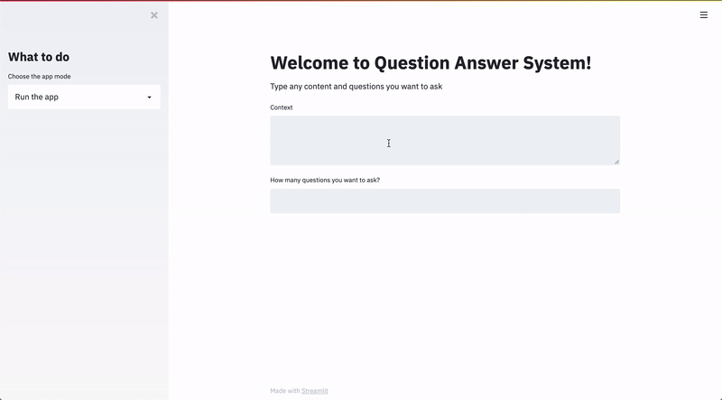

# Question Answer Project

## Dataset 
DRCD
https://github.com/DRCKnowledgeTeam/DRCD

Put the data to `question_answer_project/data`


## Environment
`python3.7.9`


## Installation
```bash 
sudo apt-get install direnv
```
add below command to `~/.zshrc`
```bash
eval "$(direnv hook zsh)"
```

```bash 
# pytorch
pip install torch torchvision
# torchserve
sudo apt-get install openjdk-11-jdk
pip install torchserve torch-model-archiver
# streamlit
pip install streamlit
```


## Directory
```bash
~/question_answer_project
├── data
│   ├── DRCD_dev.json
│   ├── DRCD_test.json
│   └── DRCD_training.json
├── output
│   ├── inference_example.json
│   ├── model_v1
│   │   ├── config.json
│   │   ├── pytorch_model.bin
│   │   ├── special_tokens_map.json
│   │   ├── tokenizer_config.json
│   │   ├── training_args.bin
│   │   └── vocab.txt
│   ├── nbest_predictions_.json
│   ├── null_odds_.json
│   ├── predictions_.json
│   └── result.txt
├── README.md
├── server
│   ├── config
│   │   ├── config_template.properties
│   │   └── handler_config.yaml
│   ├── dummy_file
│   ├── engine_serve_mars
│   │   └── qa_server.mar
│   ├── handlers
│   │   ├── dummy_handler.py
│   │   └── qa_handler.py
│   ├── logs
│   │   ├── access_log.log
│   │   ├── model_log.log
│   │   ├── model_metrics.log
│   │   ├── ts_log.log
│   │   └── ts_metrics.log
│   ├── scripts
│   │   ├── server_start.bash
│   │   └── test.bash
│   ├── test_json
│   │   ├── sample_text1.txt
│   │   └── sample_text2.txt
│   └── tmp
│       ├── output1
│       ├── output2
│       └── output3
├── src
│   ├── chinese_squad_evaluate.py
│   ├── config
│   │   └── inference_config.yaml
│   ├── evaluate.py
│   ├── inference.py
│   ├── main.py
│   ├── plot_tensorboard.py
│   ├── preprocessing.py
│   ├── runs
│   ├── scripts
│   │   ├── run_eval.bash
│   │   ├── run_squad.bash
│   │   └── run_tensorboard.bash
│   ├── training.py
│   └── utils.py
└── web
    ├── app.py
    ├── config.yaml
    ├── request_test.py
    └── run_app.bash
```

## Usage

Store your data to `~/question_answer_project/data/`.

### Train The Model

```bash
cd ~/question_answer_project/src
bash scripts/run_squad.bash
```
You can modify the args in `run_squad.bash` to fit your task.

The checkpoint will be saved on the `~/question_answer_project/output/`.

<br>
---

### Use Tensorboard 

```bash
cd ~/question_answer_project/src
bash scripts/run_tensorboard.bash
```
Always use the latest tensboard file.

<br>
---

### Evaluate The Dev Set

```bash
cd ~/question_answer_project/src
bash scripts/run_eval.bash
```

Pay attention to modify the `model_name_or_path` arg to your trained model.

The eval result will be saved on `~/question_answer_project/output/result.txt`, and the eval metrics will be appended to the last line of the file.

<br>
---

### Plot the Curves of Loss and F1

```bash
cd ~/question_answer_project/src
python plot_tensorboard.py
```

It will plot the curves of loss and F1 of latest tensorboard, and save the imgs to the directory of latest tensorboard.

**Notice!** It will plot the imgs on the terminal! If you are not using the Mac and iTerm2, and do not install `imgcat`, do not use this script. Or you should modify the `plot_tensorboard.py`. Thank you!

<br>


### Inference

```bash
cd ~/question_answer_project/src
python inference.py
```

I provide a easy inference interface to infer the content about health care with fixed questions.

All the content you want to input, the model directory, the questions, the output file path can be modify on `~/question_answer_project/src/config/inference_config.yaml`.

If default, the output will be saved on `~/question_answer_project/output/inference_example.json`. The latest inference result will be appended to the last line of the file.

In the file, the `Confidence` means the output of model calculated by `softmax`.

<br>
---

### Start the QA Server

```bash
cd ~/question_answer_project/server
bash scripts/server_start.bash
```

If you want to check the API, you can run scripts below.

```bash
bash scripts/test.bash
```

<br>
---

### Demo the Server on the Web

```bash
cd ~/question_answer_project/web
bash run_app.bash
```




